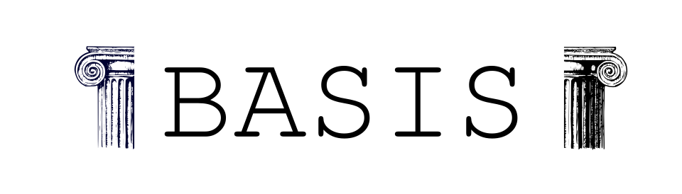

    

    

    
    
    
    

## What is?
Some time back, I friend say for me "You are son of the framework!". So I am here for to prove that he is wrong.

For to be honest, my goal with this project is to study and to improve my base.

## Install

### Clone the project
`git clone https://github.com/henriquelopeslima/basis`

### Enter to directory project and run the docker
`docker-compose up -d`

    Before this command, create a new file called `.env` from file `.env.sample`. Next, fill `.env`.

### Install the dependencies
`docker-compose exec app composer install`

### Execute the project
Access on browser `http://localhost/`